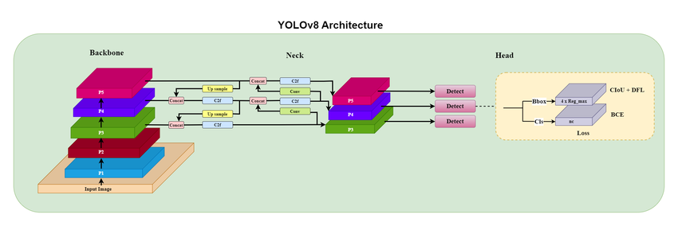
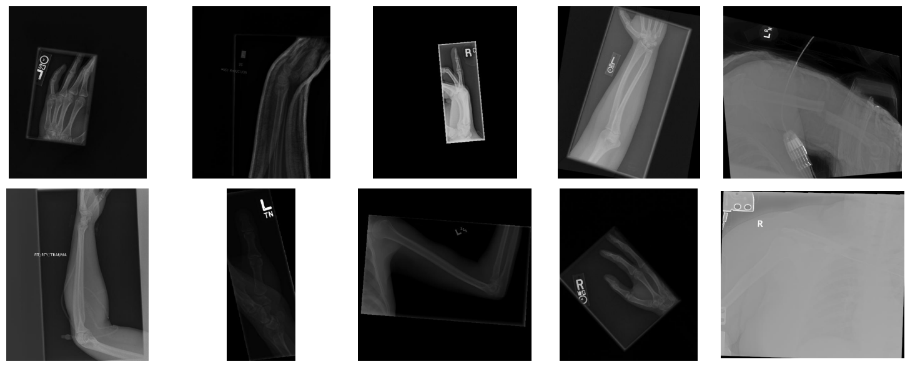

# Medical Imaging-Based Bone Fracture Detection Using YOLOv8

This project leverages YOLOv8 for automated bone fracture detection using medical imaging. The model is trained and evaluated on a labeled dataset to achieve high precision and recall.


**Biswas, S., Acharjee, S., Ali, A., & Chaudhari, S. S. (2023). Yolov8 based traffic signal detection in Indian Road.**  
_2023 7th International Conference on Electronics, Materials Engineering & Nano-Technology (IEMENTech), 1–6._  
[https://doi.org/10.1109/iementech60402.2023.10423520](https://doi.org/10.1109/iementech60402.2023.10423520)


## Dataset
Source on Kaggle:
[Bone Fracture Detection: Computer Vision Project](https://www.kaggle.com/datasets/pkdarabi/bone-fracture-detection-computer-vision-project)

NOTE: I have split the train images into two parts due to the storage limitations, please merge them before your processing

## Project Overview
The project follows these steps:
- Dataset preparation and preprocessing
- Data augmentation techniques applied to improve model generalization
- Model training using YOLOv8
- Evaluation of performance metrics
- Visualization of t-SNE embeddings

## Model Training Configuration
The model was trained using the following configuration:
- **Dataset**: `/content/bone_fracture_good_data/data.yaml`
- **Epochs**: 35
- **Image Size (per epoch)**: 640
- **Batch Size**: 16
- **Random Seed**: 42
- **Project Directory**: `/content/bone_fracture_yolo`
- **Experiment Name**: `yolov8s_experiment`
- **Augmentation Parameters**:
  - Hue Shift: `0.015`
  - Saturation Shift: `0.7`
  - Value Shift: `0.4`
  - Rotation: `30 degrees`
  - Translation: `0.2`
  - Scaling: `0.5`
  - Shear: `15.0`
  - Vertical Flip Probability: `0.5`
  - Horizontal Flip Probability: `0.5`

## Data Augmentation
To enhance the model's robustness, the following augmentation techniques were applied:
- **Random Flip**: Horizontal and vertical flips to increase variability
- **Rotation**: Random rotations up to 30 degrees
- **Scaling and Translation**: Adjusting image size and shifting objects
- **Color Jitter**: Altering hue, saturation, and brightness
- **Shearing**: Applying shear transformations to distort images
- **Gaussian Noise**: Adding noise to make the model more resilient


## Results
Key performance metrics of the model:
- **Precision**: 99.78%
- **Recall**: 100%
- **mAP@50**: 99.5%
- **mAP@50-95**: 99.5%

## Feature Visualization
The following t-SNE visualization provides insight into the feature embedding:

**t-SNE Feature Embedding of Fracture Detection**
Features were reduced to 2D space using t-SNE for better visualization.

## Installation and Usage
To run the model, ensure you have the necessary dependencies installed:
```sh
pip install ultralytics numpy pandas seaborn matplotlib
```
For training and evaluation, follow the provided scripts in the repository.

## Conclusion
This project demonstrates the effectiveness of YOLOv8 in medical imaging for automated bone fracture detection. High precision and recall indicate its potential for clinical applications.

## License
**Copyright (c) 2025 Adam Yasser**
